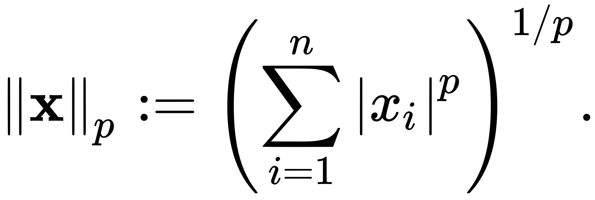

# P-norms

In general, p-norms are defined as follows: let $p >= 1$ be a real number. The p-norm of vector $x = (x_1,...,x_n)$ is:

The higher the norm index, the more it focuses on large values and neglects small ones.
Below you will find the most common p-norms.

---
## $L_0$ norm

This norm was officially established by Banach as being:

$$
(x_n) → \sum_{n} 2^{(-n)} \frac{|x_n|}{1 + |x_n|}
$$

However, in Computer Science it is often used in the following form:

$$
(x_0)^0+(x_1)^0+...+(x_n)^0
$$

Note that this is actually not a norm, because it is not homogeneous (homogeneous means that the norm scales with the vector). It also makes the assumption that $0^0=1$ which is not commonly agreed upon. 
However, it is a neat way to count all non-zero values of a vector. This can be used as a measure of similarity between two vectors - the higher the "norm", the less similar they are. An obvious application could be string comparision.

---
## $L_1$ norm

Also called Manhattan distance, it sums up all elements of a vector:

$$
\sum_{n}x_n
$$

A common interpretation of this norm is how many city blocks you have to cross in order to go from point A to point B and this is actually a good visualization of how this metric works, hence the name. 

So what is it good for:
- It places less emphasis on outliers as it gives equal weight to all observations.
- According to [this paper](https://bib.dbvis.de/uploadedFiles/155.pdf) it may be preferable to Euclidean ($L_2$ norm) for higher dimensional data.

---
## $L_2$ norm

The "classic" Euclidean norm given by the formula:

$$
\sqrt[2]{\sum_{n}(x_n)^2}
$$

What makes it so special? Well, one answer would be that it is convenient to use in a world based on Euclidean geometry. It would not be entirely true, however. One important thing about this norm is that it weights all "directions" equally so that if you were to select a point on a plane and draw a line connecting all points of equal distance from that one point, you would get a perfect circle (which you can reflect in an infinite amount of ways). Other norms would get you an elipse.

In addition, this norm implements the least-squares estimation as predicted by the [Gauss-Markov theorem](https://en.wikipedia.org/wiki/Gauss%E2%80%93Markov_theorem#Statement). This means it can be used to find the best line that fits some given data points, if we were to use a **linear unbiased estimator**.

---
## $L_\infty$ norm

This norm is given by the formula:

$$
\sqrt[\infty]{\sum_{n}|x_n|^\infty}
$$

As said in the beginning of this page, this norm totally neglects the small values and only counts the magnitude of the largest value in a vector.

---